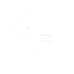

  

<!-- Badge para a Versão do Projeto -->

<!-- Badge para a Cobertura de Testes -->

<!-- Badge para a Licença do Projeto -->

<!-- Badge para Pull Requests Bem-Vindos -->

# Índice
1. Título e Imagem de Capa
2. Badges
3. Descrição do Projeto
4. Status do Projeto
5. Funcionalidades
6. Demonstração da Aplicação
7. Como Rodar o Projeto
8. Tecnologias Utilizadas
9. Contribuidores
10. Licença

## Status do Projeto

O projeto encontra-se atualmente em um estado **Desenvolvimento e em Manutenção**. Abaixo, fornecemos mais detalhes sobre o status atual:

- **Em Desenvolvimento:**
  - Destaques do que está sendo trabalhado atualmente.
  - Futuras funcionalidades ou melhorias planejadas.
  - Possíveis desafios ou solicitações de contribuições.

- **Em Manutenção:**
  - Razões para a manutenção (por exemplo, correção de bugs críticos, atualizações de segurança).
  - Sem previsão de término da manutenção.

<!--- **Estável:**
  - Descrição do que significa para o projeto ser considerado estável.
  - Informações sobre como os usuários podem contribuir ou relatar problemas.-->

**Última Atualização:** 24/01/2024

---

## Licença

**Licença Personalizada - Contato obrigatório para qualquer uso.**

Você **não tem permissão** para realizar qualquer uma das seguintes ações sem a autorização explícita dos detentores dos direitos deste projeto:

- Reproduzir, distribuir ou exibir o código-fonte ou artefatos relacionados a este projeto.
- Modificar ou criar trabalhos derivados com base no código-fonte deste projeto.
- Utilizar este projeto para qualquer finalidade, comercial ou não.

Para obter a autorização, entre em contato com os detentores dos direitos deste projeto.

Para mais detalhes, consulte o arquivo [LICENSE](LICENSE).

<h1>Linguagens e Tecnologias Ultilizadas</h1>

